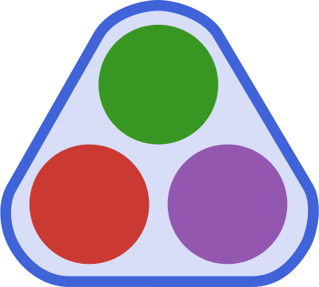

<h1 align="center"><a>   <b>HyperGraphs.jl</b> </a></h1>

The main aim of this package is to implement concepts of graph theory on hypergraphs. At the most basic level, it allows to represent high-order relationships between objects, with complete freedom to choose the type of these objects. A secondary aim follows from the realisation that most flavours of (hyper)graphs are a specific case of oriented, weighted hypergraphs; from this, it should be possible to define all methods at the hypergraph level and to programmatically specialise them for other (hyper)graph types.

Currently implemented are fundamental constructors for unoriented, unweighted hypergraphs (via the `HyperGraph` and `HyperEdge` types) and for a specific case of oriented, weighted hypergraphs: chemical hypergraphs (via the `ChemicalHyperGraph` and `ChemicalHyperEdge` types), as well as a set of functions that allow to modify hypergraphs (adding and deleting hyperedges and vertices). Flavours of hypergraphs and hyperedges are implemented with traits via [SimpleTraits.jl](https://github.com/mauro3/SimpleTraits.jl); traits implemented so far are `IsOriented` and `IsWeighted`.

For some example applications of HyperGraphs.jl, check out its sibling package [Simulacrum.jl](https://github.com/lpmdiaz/Simulacrum.jl).

## Notation and naming rules

In the code, `x` and `xs` refer to one and several hypergraphs, respectively; the same applies for `e` and `es` with hyperedges, and for `v` and `vs` with vertices.

The current idea to allow for natural extension of the core functions is to respect a set of standard field names when defining a new custom concrete type. If custom field names are needed, these should be explicitly connected to core methods (`vertices` and `hyperedges` mainly). Currently, field names should be:

- `V`, the set of vertices in a hypergraph and a hyperedge
- `E`, the set of hyperedges in a hypergraph
- `src`, the set of source vertices in an oriented hyperedge
- `tgt`, the set of target vertices in an oriented hyperedge
- `objs`, the objects of an incidence
- `mults`, the multiplicities of the objects of an incidence
- `w`, the weight of a weighted hyperedge

Then, custom names are built on top e.g. `rate(e::ChemicalHyperEdge) = weight(e)` (which is already implemented).

These symbols were chosen to differentiate hypergraphs from graphs (all graphs are hypergraphs but not all hypergraphs are graphs), and so a hypergraph is defined as X = (V, E). An alternative option was to name hypergraphs with the letter H; however, following that logic would have meant changing the symbol for hyperedges too, which would have been impractical (also H). This way, using X emphasises the difference between hypergraphs and graphs and using E for edges retains some continuity with ordinary graphs notation G = (V, E).

Functions are defined on hypergraphs `x` and edges `e` for consistency. It may be useful to add some clarity and differentiate between variables though, and so a chemical hypergraph may be defined as `chx` and a chemical hyperedge as `che`.

## Some notes on the code

A word of caution: this is a work in progress, and so functions have not been perfectly proofread for corectness (especially those in operations, neighbor functions, parallel and multi-hyperedges, loops...). E.g. currently, it is possible to add hyperedges to a hypergraph that does not have all the vertices in said hyperedges in its vertx set; this will be prevented from happening eventually.

Each graph flavour should be implemented with performance and ease of interfacing (i.e. of accessing information) in mind: there is no need to carry redundant information just because the mathematical syntax does. Hopefully this is true in the current code, but some improvements are definitely possible.

## Implementation notes

Most of these will hopefully end up in the documentation.

### Core

The source and the target of an oriented hyperedge are also referred to as head and tail, but the former notation is more explicit.

#### Default values

Default field values are implemented by overloading `Base.getproperty`. This means `object.some_field` can return a value despite `object` having no corresponding `:some_field` field.

So far, objects of type `AbstractHyperEdge` have a default `:weight` value of `1`.

#### Chemical hypergraphs and chemical hyperedges

Chemical hypergraphs represent reaction networks but are rooted in graph theory. The main reference is probably [[Jost2019]](#Jost2019).

In this implementation, I took the liberty to name _chemical hyperedges_ the reactions, following the same logic as naming _chemical hypergraph_ the hypergraph that represents a system of reactions (this is because in each case it is a specific case of hypergraph and hyperedge, namely one where the hyperedge incidence multiplicity is restricted to the positive integers, thus representing stoichiometries).

Graph theoretical concepts have natural interpretations in the context of chemical reactions represented on chemical hypergraphs. For instance, a vertex-hyperedge incidence multiplicity represents how many times a vertex occurs in a hyperedge and as such encodes stoichiometry information, while a hyperedge-hypergraph incidence multiplicity encodes for parallel hyperedges (this is not currently implemented).

Constructors set 1 as the default value for reactions rate and for stoichiometries; this is to simplify the syntax. For instance, all these calls are equivalent: `SpeciesSet(["X"])`, `SpeciesSet("X")`, `SpeciesSet("X", 1)`, `SpeciesSet(["X"], [1])`. Compared to other implementations of reaction networks, it is also easier to specify a different stoichiometry for only part of the reaction (e.g. if one needs only some of the reactants to have stoichiometries different from 1, only the reactant stoichiometries have to be specified and not those of all the species involved).

### Properties

#### Vertex degree

The usual definition of the _degree_ of a vertex v is _the number of edges incident on v_; this definition however breaks down in the case of a loop: following it strictly implies a loop has degree 1 (a loop is one edge incident on one vertex) when it is generally agreed it has degree 2 [[Bretto2013]](#Bretto2013), [[Bollobas1998]](#Bollobas1998), [[Kaminski2019]](#Kaminski2019), [[Zaslavsky1982]](#Zaslavsky1982).

A more general definition is then probably _the number of incidences at v_, as given by Zaslavsky [[Zaslavsky1982]](#Zaslavsky1982). Following this more general definition gives us degree 2 for a loop (since a loop on v is twice incident on v [[Zaslavsky1982]](#Zaslavsky1982)) while working in the same way as the former definition in other cases.

Here we implement an even more general definition of degree: the degree of vertex v is defined as _the sum of the weights of edges incident on v_, where the weight of edge e appears according to the multiplicity of v in e. In other words, the degree of v is given by the sum over edges of edge weight times the number of incidences of v in each edge. Other definitions discussed above are special cases of this more general definition.

This however means that `degree` may now return values that are not of type `Number`, depending on what type edge weights are. This may cause unexpected behaviours since some concepts rely on e.g. `maximum` or `sum` being defined on degree values. Those effectively assume that degrees are defined on the positive integers including zero.

The vertex degree is also referred to as _valency_. Additionally, the _degree_ of a graph is its maximum vertex degree [[Zhu2019]](#Zhu2019), which is not implemented here to avoid confusion.

#### Edge cardinality

The _cardinality_ of an edge is its _number of endpoints_; this can be interpreted in different ways, which becomes obvious when working with loops. If the vertices of an edge are treated as a multiset or as an _n_-tuple (e.g. when working with oriented edges), a loop should have cardinality 2. This comes from the fact that a loop has two (coinciding) endpoints ([[Zaslavsky1982]](#Zaslavsky1982), [[Zaslavsky1991]](#Zaslavsky1991)), with the cardinality of a multiset being the sum of the multiplicities of its elements. If it is instead treated as a set, a loop has cardinality 1, as is often defined (e.g. in [[Dorfler1980]](#Dorfler1980), [[Berge1989]](#Berge1989), [[Bretto2013]](#Bretto2013)). Concisely, a loop has cardinality __2__ when counting its number of endpoints; __2__ when counting the number of elements of a multiset / _n_-tuple; __1__ when counting the number of elements of a set. This seems to be what is suggested on page 4 of  [[Spivak2009]](#Spivak2009): the map that sends the set of non-empty tuples on a set S (i.e. edges) to the set non-empty subsets of S (i.e. vertices) "may decrease cardinality." The approach taken here is to adopt the most general definition (i.e. considering the vertices of edges as a multiset / an _n_-tuple) which then leaves freedom to build more specialised functions on top.

Hyperedge cardinality is also referred to as _order_ [[Zhu2019]](#Zhu2019), and as _size_. Neither of these are implemented; the former may be confused with the order of a hypergraph, and the latter may conflict with `Base.size`.

#### Other properties

The _size_ of a hypergraph is defined in [[Gallo1993]](#Gallo1993) and in [[Cambini1997]](#Cambini1997); this is implemented as `hypergraph_size` to avoid confusion with `Base.size` again.

The _order_ of a hypergraph is its number of vertices [[Wang2018]](#Wang2018), [[Zaslavsky2010]](#Zaslavsky2010). (Also note that order is used to refer to the maximum cardinality of a hypergraph in [[Zhu2019]](#Zhu2019), but this use seems unusual.)

Note that the _rank_ of a reaction network is the maximum number of linearly independent reactions [[Shinar2010]](#Shinar2010), which may be confused with the rank of a hypergraph.

A reference for the _volume_ of a hypergraph is [[Kaminski2019]](#Kaminski2019).

### Operations

Functions only do what their name implies, and so if a loop is undesirable in a specific application, one must check that e.g. the hyperedge that is about to be added to a hypergraph is not a loop.

_Weak_ deletion only deletes incidences, whereas _strong_ deletion deletes any object incident on the object(s) being deleted; this means that e.g. weak vertex deletion removes any occurrence of the given vertex in the hyperedges incident on that vertex but does not delete those hyperedges [[Chen2018]](#Chen2018), [[Rusnak2013]](#Rusnak2013). Note: vertex deletion is (incidence) dual to edge deletion [[Rusnak2013]](#Rusnak2013).

Note: currently, the internal function `_del_vertex!(e)` must have two methods: one for unoriented and one for oriented hyperedges; this is because the former method only needs to remove a vertex from `vertices(e)` when the latter needs to remove it from both the source and target sets (and both objects and multiplicities), which does not naturally work with `vertices` of an oriented hyperedge. This is somewhat messy; ideally, as mentioned above, methods would be built automatically from the hyperedge flavour (here oriented vs. unoriented), via traits.

Edge _switching_ is implemented at a high level by swapping the source and target sets of an oriented hyperedge. Switching is more fundamentally defined as the negation of incidences, e.g. in [[Reff2012]](#Reff2012), [[Rusnak2013]](#Rusnak2013).

## Future developments

This is mainly a personal repository to play around with hypergraphs, but I do plan to add more functionalities over time.

Note a potential future breaking change about the behaviour of `src` and `tgt`: these currently return the objects of the set of incidences but may return the set of incidences themselves in the future, depending on what makes sense. This also means that currently, the extension of `Base.==` does not check for equal multiplicity (which may be slightly incorrect).

## References

[Berge1989] -- Berge, C. (1989). _Hypergraphs: combinatorics of finite sets_. Amsterdam, New York, Oxford, Tokyo: Elsevier B.V.

[Bollobas1998] -- Bollobás, B. (1998). _Modern Graph Theory_. Graduate Texts in Mathematics (Vol. 184). New York, NY: Springer. [[doi]](https://doi.org/10.1007/978-1-4612-0619-4)

[Bretto2013] -- Bretto, A. (2013). _Hypergraph Theory: An Introduction_. Mathematical Engineering (Vol. 11). Heidelberg: Springer. [[doi]](https://doi.org/10.1007/978-3-319-00080-0)

[Burgio2020] -- Burgio, G., Matamalas, J. T., Gómez, S., & Arenas, A. (2020). Evolution of Cooperation in the Presence of Higher-Order Interactions: from Networks to Hypergraphs. _Entropy_. [[doi]](https://doi.org/10.3390/e22070744)

[Cambini1997] -- Cambini, R., Gallo, G., & Scutellà, M. G. (1997). Flows on hypergraphs. _Mathematical Programming, Series B_, 78(2), 195–217. [[doi]](https://doi.org/10.1007/BF02614371)

[Chen2018] --
Chen, G., Liu, V., Robinson, E., Rusnak, L. J., & Wang, K. (2018). A characterization of oriented hypergraphic Laplacian and adjacency matrix coefficients. _Linear Algebra and Its Applications_, 556, 323–341. [[doi]](https://doi.org/10.1016/j.laa.2018.07.012)

[Dorfler1980] -- Dörfler, W., & Waller, D. A. (1980). A category-theoretical approach to hypergraphs. _Archiv Der Mathematik_, 34(1), 185–192. [[doi]](https://doi.org/10.1007/BF01224952)

[Gallo1993] --
Gallo, G., Longo, G., Pallottino, S., & Nguyen, S. (1993). Directed hypergraphs and applications. _Discrete Applied Mathematics_, 42(2–3), 177–201. [[doi]](https://doi.org/10.1016/0166-218X(93)90045-P)

[Hellmuth2012] -- Hellmuth, M., Ostermeier, L., & Stadler, P. F. (2012). A Survey on Hypergraph Products. _Mathematics in Computer Science_, 6(1), 1–32. [[doi]](https://doi.org/10.1007/s11786-012-0109-6)

[Jost2019] --
Jost, J., & Mulas, R. (2019). Hypergraph Laplace operators for chemical reaction networks. _Advances in Mathematics_, 351, 870–896. [[doi]](https://doi.org/10.1016/j.aim.2019.05.025)

[Kaminski2019] --
Kamiński, B., Poulin, V., Prałat, P., Szufel, P., & Théberge, F. (2019). Clustering via hypergraph modularity. _PLoS ONE_, 14(11), 1–15. [[doi]](https://doi.org/10.1371/journal.pone.0224307)

[Reff2012] -- Reff, N., & Rusnak, L. J. (2012). An oriented hypergraphic approach to algebraic graph theory.
_Linear Algebra and Its Applications_, 437(9), 2262–2270. [[doi]](https://doi.org/10.1016/j.laa.2012.06.011)

[Rusnak2013] --
Rusnak, L. J. (2013). Oriented hypergraphs: Introduction and balance. _Electronic Journal of Combinatorics_, 20(3), 1–29. [[doi]](https://doi.org/10.37236/2763)

[Shinar2010] --
Shinar, G., & Feinberg, M. (2010). Structural sources of robustness in biochemical reaction networks. _Science_, 327(5971), 1389–1391. [[doi]](https://doi.org/10.1126/science.1183372)

[Spivak2009] -- Spivak, D. I. (2009). Higher-dimensional models of networks. _arXiv_, 1–18. Retrieved from [http://arxiv.org/abs/0909.4314](http://arxiv.org/abs/0909.4314)

[Wang2018] --
Wang, L., Egorova, E. K., & Mokryakov, A. V. (2018). Development of Hypergraph Theory. _Journal of Computer and Systems Sciences International_, 57(1), 109–114. [[doi]](https://doi.org/10.1134/S1064230718010136)

[Zaslavsky1982] -- Zaslavsky, T. (1982). Signed graphs. _Discrete Applied Mathematics_, 4(1), 47–74. [[doi]](https://doi.org/10.1016/0166-218X(82)90033-6)

[Zaslavsky1991] -- Zaslavsky, T. (1991). Orientation of Signed Graphs. _European Journal of Combinatorics_, 12(4), 361–375. [[doi]](https://doi.org/10.1016/S0195-6698(13)80118-7)

[Zaslavsky2010] --
Zaslavsky, T. (2010). Matrices in the Theory of Signed Simple Graphs. _arXiv_, 1–20. Retrieved from [http://arxiv.org/abs/1303.3083](http://arxiv.org/abs/1303.3083)

[Zhu2019] --
Zhu, H., & Masahito H. (2019). Efficient verification of hypergraph states. _Physical Review Applied_, 12(5), 054047. [[doi]](https://doi.org/10.1103/PhysRevApplied.12.054047)
